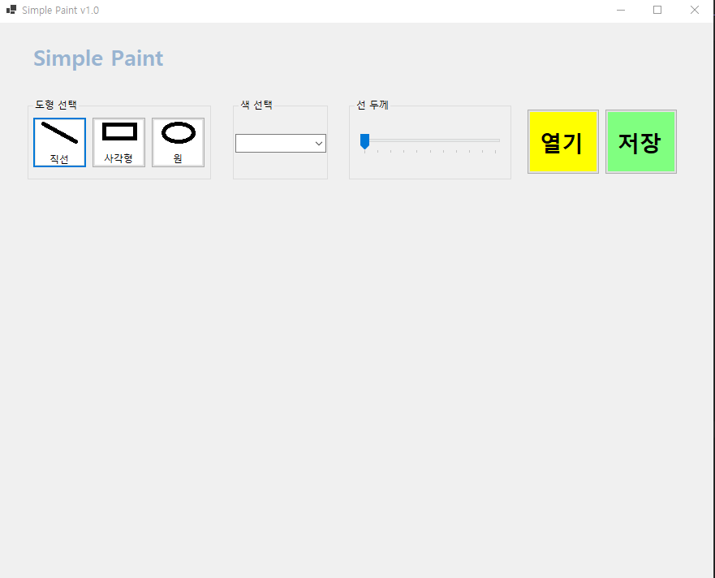
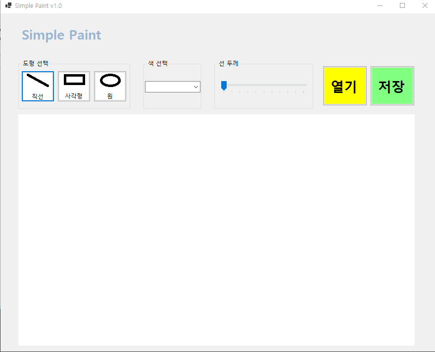

# (C# 코딩) 그림판 앱 (Simple Paint)

## 개요
- **C# 프로그래밍 학습**
- **1줄 소개**:
    - 선, 사각형, 원을 그릴 수 있는 기본적인 그림판 프로그램
- **사용한 플랫폼**: 
    - C#, .NET Windows Forms, Visual Studio, GitHub
- **사용한 컨트롤**: 
    - Label, Button, ComboBox, TrackBar, GroupBox, PictureBox
- **사용한 기술과 구현 기능**:
    - **도형 그리기**: 선, 사각형, 원을 마우스로 그릴 수 있는 기능
    - **색상 선택**: ComboBox를 사용하여 선과 도형의 색상을 선택할 수 있는 기능
    - **선 굵기 조절**: TrackBar를 사용하여 선의 굵기를 조절할 수 있는 기능
    - **그리기 모드 선택**: GroupBox와 RadioButton을 사용하여 선, 사각형, 원 중에서 그리기 모드를 선택할 수 있는 기능

## 실행 화면 (과제 1)

-과제1 코드의 실행 스크린샷

- **구현한 내용**:
    - **UI 디자인 및 배치**: `GroupBox`를 활용하여 도형 선택, 색상 선택, 선 두께 설정을 시각적으로 분리하고, `PictureBox`를 메인 캔버스 영역으로 배치하여 직관적인 사용자 인터페이스를 설계했습니다.
    - **컨트롤 명명 및 초기화**: 각 도형 버튼(직선, 사각형, 원), 색상 선택을 위한 `ComboBox`, 두께 조절용 `TrackBar` 생성.