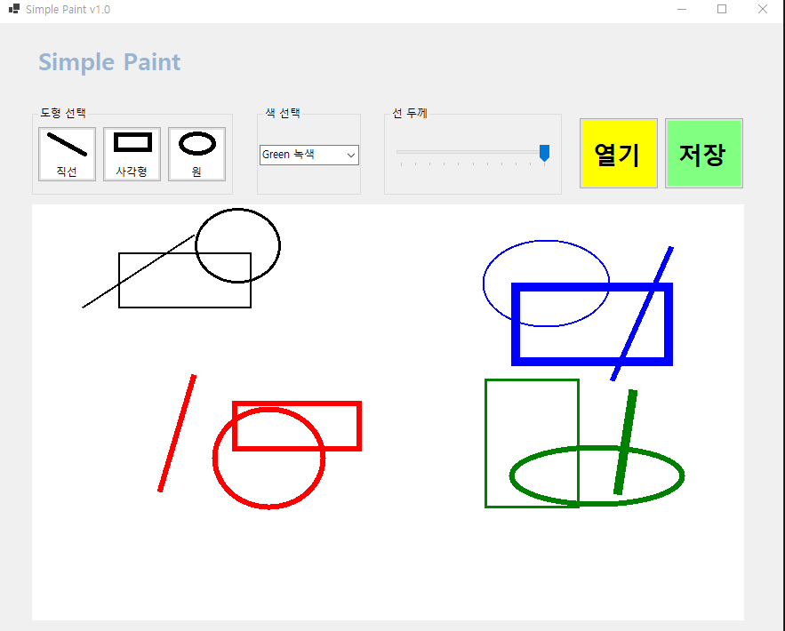
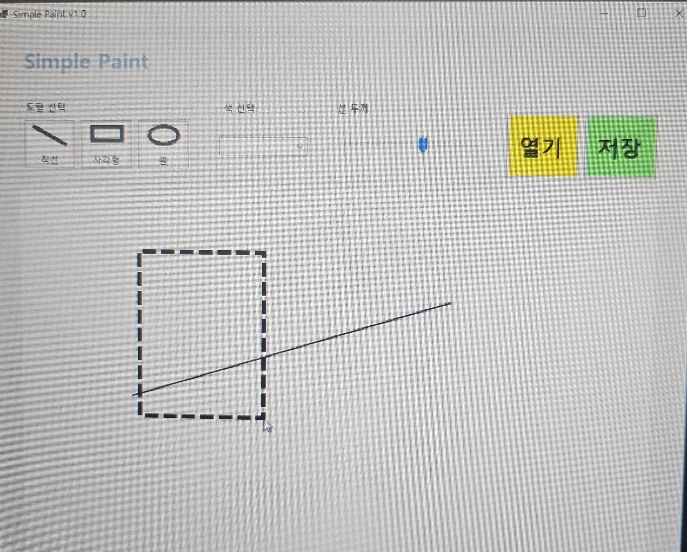
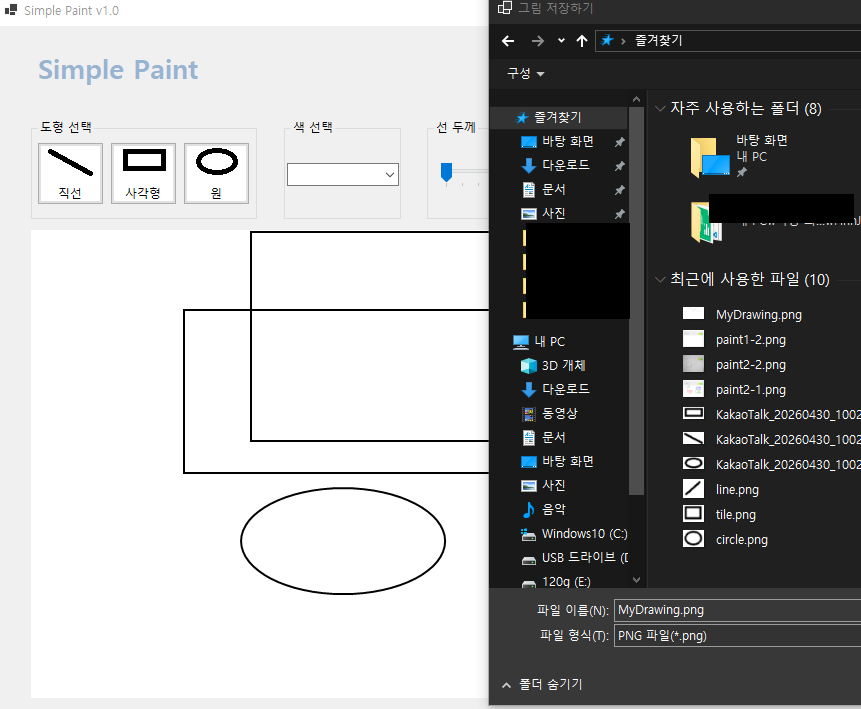
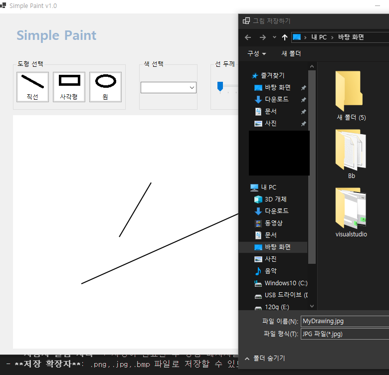
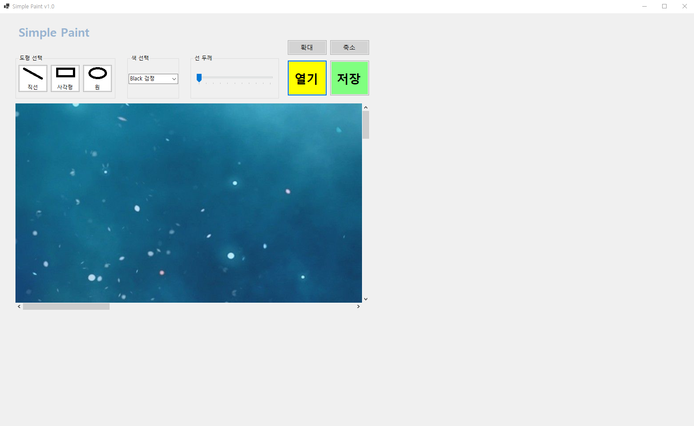
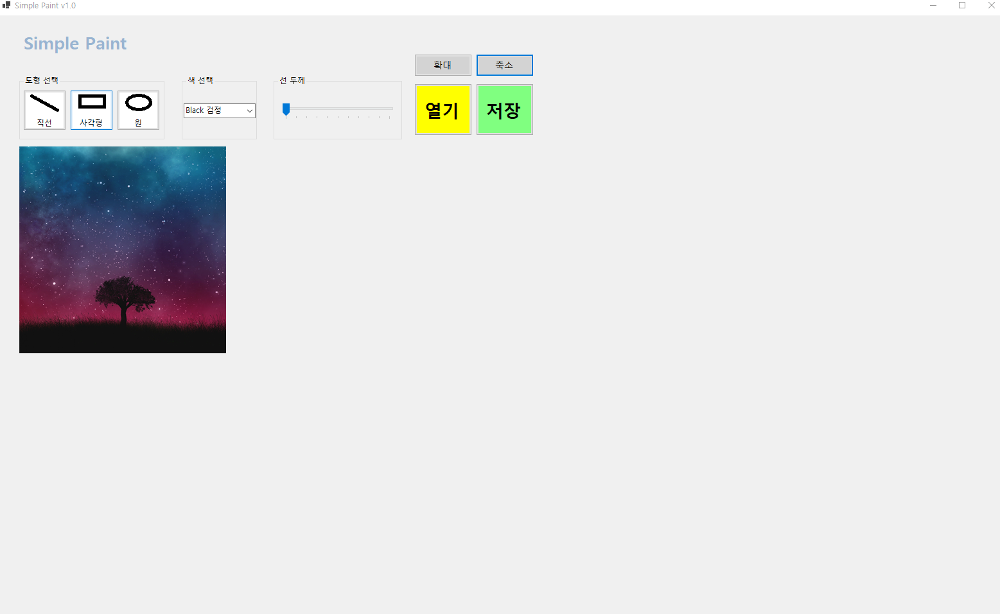
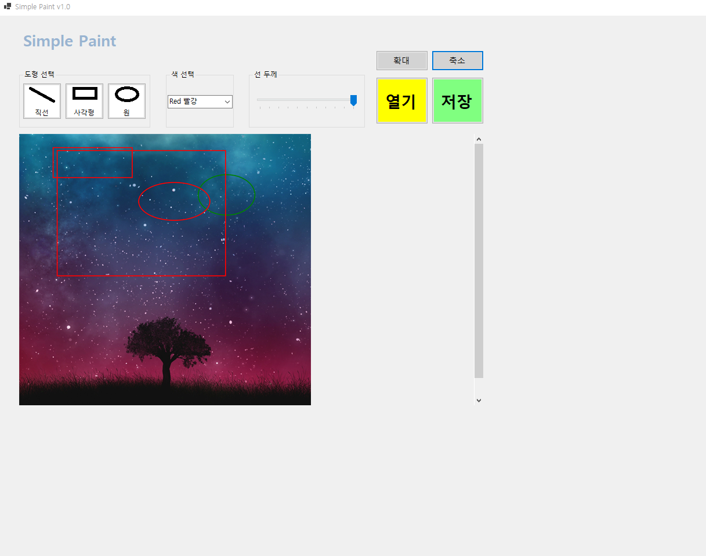

# (C# 코딩) 그림판 앱 (Simple Paint)

## 개요
- **C# 프로그래밍 학습**
- **1줄 소개**:
    - 선, 사각형, 원을 그릴 수 있는 기본적인 그림판 프로그램
- **사용한 플랫폼**: 
    - C#, .NET Windows Forms, Visual Studio, GitHub
- **사용한 컨트롤**: 
    - Label, Button, ComboBox, TrackBar, GroupBox, PictureBox
- **사용한 기술과 구현 기능**:
    - **도형 그리기**: 선, 사각형, 원을 마우스로 그릴 수 있는 기능
    - **색상 선택**: ComboBox를 사용하여 선과 도형의 색상을 선택할 수 있는 기능
    - **선 굵기 조절**: TrackBar를 사용하여 선의 굵기를 조절할 수 있는 기능
    - **그리기 모드 선택**: GroupBox와 RadioButton을 사용하여 선, 사각형, 원 중에서 그리기 모드를 선택할 수 있는 기능

## 실행 화면 (과제 1)

-과제1 코드의 실행 스크린샷

- **구현한 내용**:
    - **UI 디자인 및 배치**: `GroupBox`를 활용하여 도형 선택, 색상 선택, 선 두께 설정을 시각적으로 분리하고, `PictureBox`를 메인 캔버스 영역으로 배치하여 직관적인 사용자 인터페이스를 설계했습니다.
    - **컨트롤 명명 및 초기화**: 각 도형 버튼(직선, 사각형, 원), 색상 선택을 위한 `ComboBox`, 두께 조절용 `TrackBar` 생성.

## 실행 화면 (과제 2)

- 과제 2 코드의 실행 스크린샷

- **구현한 내용**:
    - **마우스 이벤트 핸들링**: `MouseDown`, `MouseMove`, `MouseUp`의 3단계 이벤트를 조합하여 드래그 앤 드롭 방식의 그리기 기능을 구현했습니다.
    - **실시간 가이드라인 구현**: 마우스를 드래그하는 동안 `Invalidate()`를 호출하고 `Paint` 이벤트에서 임시 도형을 그리도록 처리하여, 최종 확정 전 도형의 형태를 미리 볼 수 있는 피드백 기능을 추가했습니다.
    - **그래픽 렌더링 최적화**: `Bitmap` 기반의 더블 버퍼링 원리를 이해하고, `Graphics` 객체를 사용하여 선(`DrawLine`), 사각형(`DrawRectangle`), 원(`DrawEllipse`)을 부드럽게 렌더링했습니다.
    - **좌표 계산 로직**: 마우스 시작점과 현재점 사이의 좌표를 계산하여 사각형과 원의 크기(Width, Height) 및 시작 위치를 동적으로 결정하는 로직을 적용했습니다.
    - **미리보기 기능**: `PictureBox`의 `Paint` 이벤트에서 현재 그리는 도형을 실시간으로 점선으로 렌더링하여, 사용자가 도형의 위치와 크기를 시각적으로 확인할 수 있도록 구현했습니다.
    - 
## 실행 화면 (과제 3)

- 과제 3 코드의 실행 스크린샷
 

- **구현한 내용**:
    - **파일 시스템 연동**: `SaveFileDialog`를 연동하여 사용자가 원하는 경로에 작업물을 저장할 수 있는 표준 인터페이스를 제공했습니다.
    - **다양한 포맷 지원**: 파일 필터(Filter) 설정을 통해 PNG, JPG, BMP 등 주요 이미지 확장자를 선택하여 저장할 수 있도록 구현했습니다.
    - **비트맵 데이터 보존**: `PictureBox`에 표시된 `Image` 객체를 파일 스트림으로 변환하고, `Save` 메서드를 호출하여 메모리상의 그래픽 데이터를 물리적인 파일로 기록했습니다。
    - **사용자 알림 처리**: 저장이 완료된 후 성공 메시지를 출력하여 작업이 정상적으로 수행되었음을 인지할 수 있도록 예외 처리를 포함했습니다。

## 실행 화면 (과제 4)

- 과제 4 코드의 실행 스크린샷 (외부 이미지 로드 및 편집 화면)

- **구현한 내용**:
    - **외부 리소스 로딩**: `OpenFileDialog`를 사용하여 로컬 환경의 이미지 파일을 앱 내 캔버스로 불러오는 기능을 구현했습니다.
    - **캔버스 동적 갱신**: 불러온 이미지를 새로운 `Bitmap` 객체로 복사하고 `Graphics.FromImage`를 통해 해당 이미지 위에 추가적인 그리기가 가능하도록 도화지를 재구성했습니다.
    - **해상도 및 크기 유지**: 불러온 이미지의 크기에 맞춰 `PictureBox`의 이미지를 설정하고, 이미지의 픽셀 정보를 유지하면서 그 위에 도형을 덧그릴 수 있는 레이어 구조를 논리적으로 구현했습니다.
    - **편집 기능 통합**: 외부 이미지를 불러온 상태에서도 과제 1, 2에서 구현한 도형 그리기와 과제 3의 저장 기능이 유기적으로 동작하도록 전체 코드를 통합했습니다.